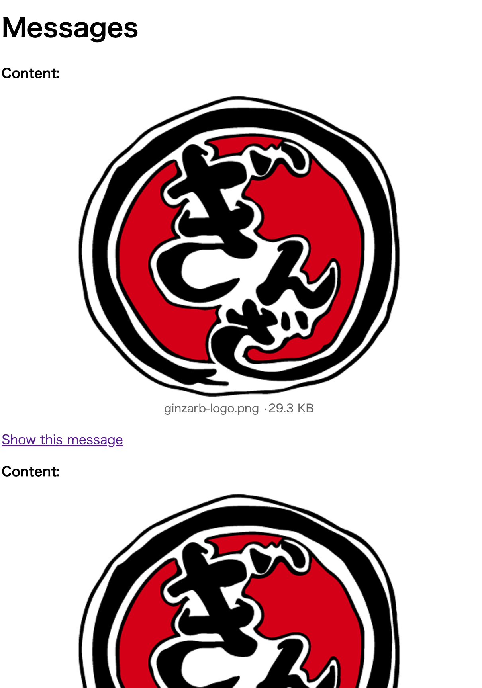

# README

Sample Rails Application for [eager load doesn't work as expected in Action Text · Issue #36177 · rails/rails](https://github.com/rails/rails/issues/36177) part2.

[previous version](https://github.com/willnet/actiontextnplus1)

## Setup

1. git clone
2. ./bin/setup
3. ./bin/rails s
4. open http://localhost:3000/messages
5. Add some messages like this



6. visit http://localhost:3000/messages again
7. see log/development.log

ex:
```
Started GET "/messages" for ::1 at 2023-09-30 22:16:24 +0900
Processing by MessagesController#index as HTML
  Rendering layout layouts/application.html.erb
  Rendering messages/index.html.erb within layouts/application
  Message Load (0.1ms)  SELECT "messages".* FROM "messages"
  ↳ app/views/messages/index.html.erb:6
  ActionText::RichText Load (0.1ms)  SELECT "action_text_rich_texts".* FROM "action_text_rich_texts" WHERE "action_text_rich_texts"."record_type" = ? AND "action_text_rich_texts"."name" = ? AND "action_text_rich_texts"."record_id" IN (?, ?, ?)  [["record_type", "Message"], ["name", "content"], ["record_id", 3], ["record_id", 4], ["record_id", 5]]
  ↳ app/views/messages/index.html.erb:6
  ActiveStorage::Attachment Load (0.1ms)  SELECT "active_storage_attachments".* FROM "active_storage_attachments" WHERE "active_storage_attachments"."record_type" = ? AND "active_storage_attachments"."name" = ? AND "active_storage_attachments"."record_id" IN (?, ?, ?)  [["record_type", "ActionText::RichText"], ["name", "embeds"], ["record_id", 3], ["record_id", 4], ["record_id", 5]]
  ↳ app/views/messages/index.html.erb:6
  ActiveStorage::Blob Load (0.1ms)  SELECT "active_storage_blobs".* FROM "active_storage_blobs" WHERE "active_storage_blobs"."id" IN (?, ?, ?)  [["id", 3], ["id", 5], ["id", 7]]
  ↳ app/views/messages/index.html.erb:6
  ActiveStorage::Blob Load (0.0ms)  SELECT "active_storage_blobs".* FROM "active_storage_blobs" WHERE "active_storage_blobs"."id" = ? LIMIT ?  [["id", 3], ["LIMIT", 1]]
  ↳ app/views/messages/_message.html.erb:4
  Rendered active_storage/blobs/_blob.html.erb (Duration: 0.4ms | Allocations: 424)
  Rendered /Users/willnet/.rbenv/versions/3.2.2/lib/ruby/gems/3.2.0/bundler/gems/rails-a5f113f4332b/actiontext/app/views/action_text/contents/_content.html.erb within layouts/action_text/contents/_content (Duration: 2.4ms | Allocations: 2668)
  Rendered messages/_message.html.erb (Duration: 2.9ms | Allocations: 3002)
  ActiveStorage::Blob Load (0.0ms)  SELECT "active_storage_blobs".* FROM "active_storage_blobs" WHERE "active_storage_blobs"."id" = ? LIMIT ?  [["id", 5], ["LIMIT", 1]]
  ↳ app/views/messages/_message.html.erb:4
  Rendered active_storage/blobs/_blob.html.erb (Duration: 0.4ms | Allocations: 411)
  Rendered /Users/willnet/.rbenv/versions/3.2.2/lib/ruby/gems/3.2.0/bundler/gems/rails-a5f113f4332b/actiontext/app/views/action_text/contents/_content.html.erb within layouts/action_text/contents/_content (Duration: 2.4ms | Allocations: 2655)
  Rendered messages/_message.html.erb (Duration: 2.7ms | Allocations: 2988)
  ActiveStorage::Blob Load (0.0ms)  SELECT "active_storage_blobs".* FROM "active_storage_blobs" WHERE "active_storage_blobs"."id" = ? LIMIT ?  [["id", 7], ["LIMIT", 1]]
  ↳ app/views/messages/_message.html.erb:4
  Rendered active_storage/blobs/_blob.html.erb (Duration: 0.2ms | Allocations: 411)
  Rendered /Users/willnet/.rbenv/versions/3.2.2/lib/ruby/gems/3.2.0/bundler/gems/rails-a5f113f4332b/actiontext/app/views/action_text/contents/_content.html.erb within layouts/action_text/contents/_content (Duration: 1.7ms | Allocations: 2655)
  Rendered messages/_message.html.erb (Duration: 2.0ms | Allocations: 2988)
  Rendered messages/index.html.erb within layouts/application (Duration: 11.4ms | Allocations: 12730)
  Rendered layout layouts/application.html.erb (Duration: 12.7ms | Allocations: 15211)
Completed 200 OK in 13ms (Views: 12.5ms | ActiveRecord: 0.5ms | Allocations: 15476)
```

There are many `ActiveStorage::Blob Load`!
